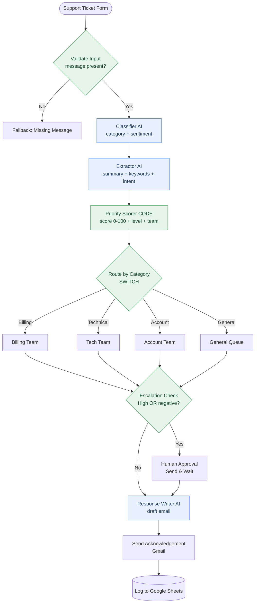

# Customer Support Ticket Triage & Routing Agent (n8n)

> An agentic n8n workflow that reads an incoming support ticket, uses AI to **classify, extract, and reply**, and uses deterministic logic to **score priority, route to the right team, escalate risky tickets to a human, and log every ticket** — turning a messy inbox into a sorted, actioned queue.

Built for the assignment **"Agentic Workflow Design and n8n Demo"** (individual submission).

---

## 1. Problem statement

**Who is the user?**
Small/medium support teams (and the customers who message them). Think a startup with one shared `support@` inbox.

**The pain point.**
Tickets arrive as free-form text and pile up *unsorted*. A human has to read each one, guess the category, judge how angry/urgent the customer is, decide who should handle it, and write a reply. This is slow and inconsistent:
- Urgent/angry customers wait in the same queue as trivial questions.
- Billing/outage issues get the same treatment as "how do I change my avatar?"
- Replies are delayed, so customers feel ignored.
- Nothing is logged consistently, so there's no audit trail.

**Why it matters.**
Slow first response is the #1 driver of support dissatisfaction and churn. The first 5 minutes are mostly *mechanical* (sort, prioritise, route, acknowledge) — exactly the part a workflow can automate, while keeping humans in control of the risky calls.

**What output the workflow produces.**
For every submitted ticket:
1. A structured record — `{ category, sentiment, summary, keywords, intent, priority_score, priority_level, team }`.
2. A routing decision (which team owns it).
3. A human-approval step for high-priority/negative tickets.
4. A polite, personalised acknowledgement email to the customer.
5. A row appended to a Google Sheet (the durable ticket log).

---

## 2. Workflow explanation

Input → AI reasoning → deterministic control → human gate → AI writing → tools (email + sheet).

| # | Node | What it does |
|---|------|--------------|
| 1 | **Support Ticket Form** *(trigger)* | Public form collecting name, email, ticket message, and an optional product area. |
| 2 | **Validate Input** *(IF)* | Fallback gate. If the message is empty → safe rejection path. Otherwise continue. |
| 3 | **Classifier (AI)** | Agent role #1. Returns strict JSON `{ category, sentiment }`. |
| 4 | **Extractor (AI)** | Agent role #2. Returns strict JSON `{ summary, issue_keywords[], customer_intent }`. |
| 5 | **Priority Scorer** *(Code)* | Deterministic. Computes `priority_score` (0–100) and `priority_level`, applies AI fallbacks, and builds one consolidated ticket record. |
| 6 | **Route by Category** *(Switch)* | Deterministic routing into Billing / Tech / Account / General branches. |
| 7 | **Team label nodes** *(Set ×4)* | Tag the branch (`routed_to`) and pass the record through. |
| 8 | **Escalation Check** *(IF)* | Deterministic. `priority_level == High` **OR** `sentiment == negative` → human review. |
| 9 | **Human Approval** *(Gmail — Send & Wait)* | Human-in-the-loop. Emails a support lead Approve/Disapprove buttons and **pauses** the run. |
| 10 | **Response Writer (AI)** | Agent role #3. Drafts a warm, personalised acknowledgement email body. |
| 11 | **Send Acknowledgement** *(Gmail)* | Emails the draft to the customer (with a hard-coded fallback body). |
| 12 | **Log to Google Sheets** | Appends the ticket record as a row (the audit log). |
| — | **Fallback: Missing Message** *(Set)* | Terminal safe output for the empty-message branch. |

**Branches / routing in plain English**
- *Missing-input branch:* empty message → clean rejection, no crash.
- *Category branch (Switch):* 4 outputs → the matching team; all re-converge into the escalation check.
- *Escalation branch (IF):* High/negative → human approval first; everything else → straight to the auto-reply.
- *AI-failure branch:* each AI node retries, then "continues" — and the deterministic Code node fills safe defaults so the run never breaks.

**Final output:** an acknowledgement email in the customer's inbox + a fully populated row in the ticket log sheet.

---

## 3. Architecture diagram



Plain ASCII fallback:

```
Form ─▶ Validate Input ─(empty)─▶ Fallback: Missing Message
                │(ok)
                ▼
        Classifier (AI) ─▶ Extractor (AI) ─▶ Priority Scorer (Code)
                                                     │
                                                     ▼
                                        Route by Category (Switch)
                              ┌──────────┬──────────┬──────────┐
                           Billing     Tech      Account     General
                              └──────────┴────┬─────┴──────────┘
                                              ▼
                                     Escalation Check (IF)
                              (High OR negative?) ──Yes──▶ Human Approval (Send & Wait)
                                       │No                         │
                                       ▼                           ▼
                                 Response Writer (AI) ◀────────────┘
                                       ▼
                                 Send Acknowledgement (Gmail)
                                       ▼
                                 Log to Google Sheets
```

---

## 4. AI vs Deterministic (the key design decision)

> Rule of thumb used here: **AI for judgement** (reading messy human text), **deterministic code for control** (scoring, routing, thresholds, side-effects). The two are deliberately separated so behaviour is predictable and auditable.

| Node | Type | Why |
|------|------|-----|
| Support Ticket Form | Deterministic (tool) | Fixed input contract. |
| Validate Input | **Deterministic** | A rule (`message not empty`), not a judgement. |
| Classifier (AI) | **AI** | Understanding intent/tone from free text needs reasoning. |
| Extractor (AI) | **AI** | Summarising + pulling keywords/intent is a language task. |
| Priority Scorer | **Deterministic** | Scoring must be repeatable & explainable — never "ask the model how urgent." |
| Route by Category | **Deterministic** | Routing is a lookup, not a guess. |
| Team label nodes | Deterministic | Branch tagging. |
| Escalation Check | **Deterministic** | A threshold rule decides human involvement — must be reliable. |
| Human Approval | Human-in-the-loop (tool) | Risky/angry tickets need a person. |
| Response Writer (AI) | **AI** | Writing a natural, empathetic reply is a generation task. |
| Send Acknowledgement | Deterministic (tool) | Just sends the email. |
| Log to Google Sheets | Deterministic (tool) | Just records the row. |

**AI is used in exactly 3 places** (classify, extract, write). **Every control decision is deterministic.** That is the whole point of the design.

---

## 5. Agentic practices demonstrated

- **Role definition** — three single-purpose AI agents: *Classifier*, *Extractor*, *Response Writer* (each with one job and one prompt).
- **Structured / schema outputs** — AI #1 and #2 are forced to strict JSON via Structured Output Parsers (`{category,sentiment}` and `{summary,issue_keywords,customer_intent}`).
- **Tool use / integrations** — Form (input), Gmail (approval + reply), Google Sheets (log).
- **Routing / branching** — Switch routes by category; IF branches for validation and escalation.
- **Deterministic checks & thresholds** — priority scoring and the High/negative escalation rule are pure code.
- **Human-in-the-loop** — Gmail *Send and Wait for Approval* pauses the run for risky tickets.
- **Fallback / error handling** — empty-message gate, per-AI retries with `continueRegularOutput`, and safe defaults in the Code node so a failed AI call never breaks the run.
- **Task decomposition** — one fuzzy goal ("handle this ticket") is split into classify → extract → score → route → escalate → write → send → log.

---

## 6. How to set up & run

### Prerequisites
- An n8n instance (see Deployment below).
- An **OpenAI** API key (or swap the model nodes for any chat model n8n supports).
- A **Gmail** account (OAuth2) for the approval + acknowledgement emails.
- A **Google Sheet** with a header row: `Timestamp, Ticket ID, Name, Email, Category, Sentiment, Priority Level, Priority Score, Team, Summary`.

### Steps
1. **Import** `workflow.json` → in n8n: top-right menu → **Import from File** → choose `workflow.json`.
2. **Add credentials** (the JSON ships with placeholders, nothing real):
   - Open each **OpenAI Model (...)** node → select/create your *OpenAI* credential.
   - Open **Human Approval** and **Send Acknowledgement** → select/create your *Gmail OAuth2* credential.
   - Open **Log to Google Sheets** → select/create your *Google Sheets OAuth2* credential, then set **Document ID** (`REPLACE_GOOGLE_SHEET_ID`) to your sheet and pick the sheet/tab.
3. **Set recipients** — in **Human Approval**, change `support-lead@company.example` to a real inbox you can click "Approve" from.
4. **Save**, then **Activate** the workflow (top-right toggle) so the form URL goes live.
5. Open the **Support Ticket Form** node → copy the **Production/Test URL** → submit a ticket (use `sample_input.json` for content).
6. Watch it run: classify → extract → score → route → (approve if needed) → email → sheet row.

> Tip for a quick demo: open the workflow, click **Test workflow**, then submit the form URL — you'll see each node light up with data.

---

## 7. Deployment instructions

### Option A — Run locally (recommended for the demo)
Fastest way to get `localhost:5678`.

**With npx (Node 18+):**
```bash
npx n8n
# then open http://localhost:5678
```

**With Docker:**
```bash
docker run -it --rm \
  --name n8n \
  -p 5678:5678 \
  -v n8n_data:/home/node/.n8n \
  n8nio/n8n
# then open http://localhost:5678
```

> The **Send and Wait** approval step emails a link the human clicks to resume the run. For that link to be reachable from your email, set a public webhook URL, e.g. run `npx n8n` with a tunnel: `npx n8n start --tunnel` (dev only), or set `WEBHOOK_URL=https://<your-public-url>/` if you have one.

### Option B — Deploy free in the cloud
**n8n Cloud (easiest):**
1. Sign up at <https://n8n.io> → start the free trial / free tier.
2. In your cloud instance: **Import from File** → `workflow.json`.
3. Add credentials (OpenAI, Gmail, Google Sheets) and activate. The webhook/form URL and approval links are public automatically — no tunnel needed.

**Render / Railway (self-host free tier):**
1. Create a new **Web Service** from the Docker image `n8nio/n8n` (Render: "New + → Web Service → Deploy an existing image").
2. Set environment variables:
   - `N8N_HOST` = your service domain (e.g. `your-app.onrender.com`)
   - `N8N_PORT` = `5678` (Render: also expose this port)
   - `N8N_PROTOCOL` = `https`
   - `WEBHOOK_URL` = `https://your-app.onrender.com/`
   - `N8N_ENCRYPTION_KEY` = any long random string (keep it stable)
3. Add a persistent disk mounted at `/home/node/.n8n` so workflows/credentials survive restarts.
4. Deploy, open the URL, **Import from File** → `workflow.json`, add credentials, activate.

---

## 8. Push this repo to GitHub

First create an **empty** repo on <https://github.com> (no README/.gitignore — this repo already has them). Then:

```bash
git init
git add .
git commit -m "Agentic Customer Support Ticket Triage n8n workflow"
git branch -M main
git remote add origin <my-repo-url>
git push -u origin main
```

---

## 9. Sample input / output

**Input** (`sample_input.json`) — a billing ticket from an angry customer:
> "I was charged twice for my subscription this month and I need a refund urgently. This is unacceptable, please fix this ASAP. My invoice number is INV-48213."

**Output** (`sample_output.json`, abridged):
```json
{
  "classifier_ai_output": { "category": "Billing", "sentiment": "negative" },
  "priority_scorer_output": { "priority_score": 87, "priority_level": "High", "team_label": "Billing Team" },
  "escalation_decision": { "needs_human_review": true },
  "actions_taken": { "email_sent_to_customer": "priya.sharma@example.com", "google_sheets_row_appended": { "Category": "Billing", "Priority Level": "High" } }
}
```
Score breakdown: Billing `30` + negative `25` + urgency hits ×4 (`urgent`, `asap`, `charged`, `refund`) capped → `32` = **87 → High** → escalated to a human → personalised reply sent → logged. (Reproduce locally with `node priority_scorer.js`.)

---

## 10. Limitations & future improvements

**Limitations**
- AI classification/sentiment can be wrong on sarcasm or mixed-language text; that's *why* scoring/routing are deterministic and high/negative tickets get a human.
- One ticket = one form submission (no email-inbox ingestion yet).
- The priority weights are hand-tuned heuristics, not learned from data.
- The Send-and-Wait approval needs a reachable webhook URL (trivial on cloud, needs a tunnel locally).

**Future improvements**
- Ingest from a real channel (Gmail trigger / IMAP / Intercom) instead of a form.
- Add a **knowledge-base lookup** (vector store / RAG) so the Response Writer can suggest a real solution, not just acknowledge.
- Detect language and reply in the customer's language.
- Auto-create a ticket in a real system (Zendesk/Jira/Linear) instead of a sheet.
- Feed resolved-ticket data back to re-tune the priority weights.
- Add a duplicate/spam guard before the AI calls (cost control).

---

## 11. Individual contribution note

This is **my own, fully individual submission.** I designed and built the entire workflow end-to-end:
- **Problem framing & decomposition** — chose support-ticket triage and split the goal into classify → extract → score → route → escalate → write → send → log.
- **AI agents & prompts** — wrote the Classifier, Extractor, and Response Writer roles and their prompts, and forced JSON output with Structured Output Parsers.
- **Deterministic logic** — designed and wrote the Priority Scorer (`priority_scorer.js`): category weights, sentiment boost, urgency-keyword scan, 0–100 score, level thresholds, and the team-routing map.
- **Control flow** — the Validate Input gate, the category Switch, the High/negative escalation IF, and the branch re-convergence.
- **Human-in-the-loop** — the Gmail Send-and-Wait approval for risky tickets.
- **Integrations & resilience** — Gmail send, Google Sheets logging, and the fallback/retry strategy so AI failures degrade gracefully instead of crashing.

*Submitted by:* **Shivam Tiwari**, Roll No: **23BCS10104** — BITS Pilani.

---

## 12. Design decisions (made so you don't have to ask)

- **OpenAI `gpt-4o-mini`** as the default model — cheap, fast, and good enough for classify/extract/write. Swap the `OpenAI Model` nodes for any chat model n8n supports; nothing else changes.
- **Three AI agents, not one mega-prompt** — keeps each step testable and matches the "separate agentic roles" goal.
- **One consolidated record in the Code node** — every downstream node reads from `Priority Scorer` via `$('Priority Scorer')`, which keeps expressions simple and survives the Send-and-Wait branch (which doesn't pass input data through).
- **Team mapping lives in the Code node** (single source of truth) while the **Switch** does the visible routing — so the routing decision is both auditable *and* demonstrable.
- **Gmail for both approval and reply** — one credential type for the demo. Replace with the SMTP "Send Email" node if you don't want Gmail.
- **`temperature: 0`** for classify/extract (stable labels), **`0.4`** for the reply (natural wording).

## Repo contents
```
README.md            – this file
workflow.json        – the importable n8n workflow
priority_scorer.js   – deterministic scorer (reference copy of the Code node)
sample_input.json    – example support ticket
sample_output.json   – the resulting record + actions
screenshots/         – screenshots.md tells you exactly what to capture
video_script.md      – word-for-word 5–8 min demo script
```
